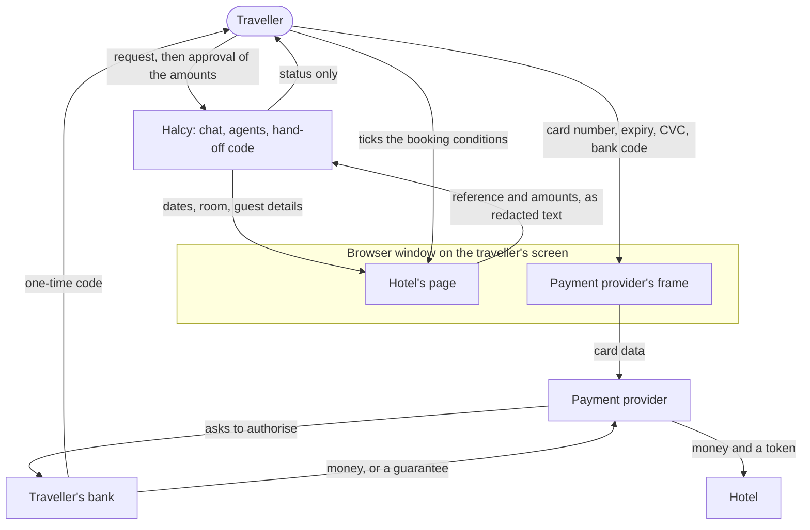

# Halcy agentic checkout: design

How Halcy turns a chat message into a hotel booking by driving the hotel's own
website, with the traveller paying the hotel directly. It answers the three
questions in `halcy_case_material/BRIEF.md`. Longer material is linked.

**State on 2026-10-06.** The prototype takes the three example asks on the
mock hotel to the approval card, repeatedly, and has completed one full
booking through payment with a script standing in for the traveller. It has
never run on a second hotel, and no person has yet paid in the window. What is
and is not shown is listed in `limitations/`.

## 1. Architecture

One Node process holds the chat server, four model-driven roles, a scorer in
code, the payment hand-off and one Chromium browser. The mock hotel and its
payment provider run as a second local process on two origins.

| Part | Job (code under `halcy_case_material/starter/agent/`) |
| --- | --- |
| Orchestrator | The only role that talks to the traveller. Structures the request, delegates, shows the approval card |
| Objective | One call: the goal becomes weights, hard constraints and a threshold |
| Search | Drives a hotel site it has never seen; records every room and rate with the facts the page states |
| Scoring | Code. Scores run from 0 to the sum of the weights, so they can be explained and repeated |
| Validation | Re-checks one candidate on the live page, up to the page that shows what is charged now and what at the hotel |
| Hand-off | A fixed sequence in code. The traveller pays in the hotel's page; Halcy waits without looking and reports a status |
| Guarded driver | Every read and action passes an origin allowlist and a blind mode; frames outside the hotel's site are never entered |

**One booking, step by step.**

1. The traveller writes in the chat. A card number typed by mistake is removed
   before anything reads the message.
2. The orchestrator resolves the dates, asks one question if something
   essential is missing, and records a structured goal.
3. The objective role sets weights and hard constraints. Search opens the
   hotel's site, clears the cookie banner, drives the date picker and guest
   counter, and records each room-and-rate combination. Code scores them.
4. The orchestrator validates one candidate: it selects it, declines the
   upsell, unticks add-ons the traveller did not ask for, fills the
   traveller's own details, and stops on the payment page. That page is the
   first to show tourist tax and the charged-now split, so its figures are
   the ones the traveller is shown.
5. The traveller sees one card and presses "Continue to payment" or not.
6. Code checks that the browser is on the candidate validated last, that the
   validation was accepted, that at least 5 minutes of the hotel's hold remain
   and that the agreed amounts are still on the page. Then it goes blind: no
   read, action or screenshot until the traveller is done.
7. The traveller types the card, ticks the hotel's conditions and confirms
   with their bank, in the hotel's page.
8. When the tab leaves the payment page, a chat button is pressed, the window
   closes or the deadline passes, code reads the hotel's page once, with card
   fields and the last four digits redacted, and decides a status.
9. The traveller gets a templated message: booked with a reference, declined
   in the hotel's words, or "I can't see a booking".

Production layout, not deployed: the same roles in a Cloud Run worker and the
hotel's site in a WebView inside the Halcy app, so the hotel session is the
phone's own (`infrastructure.md`, `../agent/WEBVIEW-PLAN.md`).

## 2. Question 1: model selection

**Rule: a heavy model where an error is expensive and the volume low; a
cheaper one where the volume is high and the error is caught downstream.**

| Role | Model | Why | When it is wrong |
| --- | --- | --- | --- |
| Orchestrator | Opus 5.5, medium effort | Its words go straight to the traveller; nobody checks them after | The message is in the run log; approval needs a button press |
| Objective | Opus 5.5, low effort | A need scored as a wish wastes a search; it is one short call, so a cheaper model saves a fraction of a cent | Validation checks the candidate against the goal |
| Search | Sonnet 5.5, medium effort | The largest role, about 40% of cost, and validation re-checks its result on the live page | The candidate is rejected and the traveller is told why |
| Validation | Opus 5.5, low effort | It reads the price the traveller approves | Code overrules an acceptance when the page is on a different rate; the hand-off re-checks the amounts on the page |
| Scoring, hand-off | No model | Must be explainable, and must have no context a card number could land in | n/a |

Measured on the three example asks with a scripted traveller, cost and wall
time from message to approval card (`../agent/MODELS.md` section 5):

| Ask | Every role on Opus 5.5 | Sonnet 5.5 on search, run 1 | Run 2 |
| --- | --- | --- | --- |
| 1 | $0.31, 116 s | $0.22, 85 s | $0.27, 96 s |
| 2 | $0.47, 181 s | $0.41, 176 s | $0.38, 166 s |
| 3 | $0.40, 123 s | $0.27, 125 s | $0.28, 108 s |

Both set-ups recorded the same candidates at the mock's exact prices and
reached the card 3 of 3. Prompt caching carries the cost: 85% of input tokens
are cache reads. The payment step adds one small call, under a cent.

**What we would measure:** bookings that reach the approval card; right room
and rate per case; validation rejections and failed actions; turns and wall
time, since the hold is 15 minutes; cost per completed booking, not per
request; and all of it on a hotel never seen. The bar for a cheaper model is
"no worse": about $0.10 per booking is at stake and one failed booking
outweighs many of those. Today's evidence is one or two runs per cell on one
hotel. `MODEL_SEARCH=claude-opus-5-5` reverts the choice.

## 3. Question 2: staying out of payments

**The rule: no model and no Halcy log receives payment data. A model is told
the payment status, nothing else.** The payment step is therefore code, not an
agent, and Halcy never holds, moves or collects money.

| Party | Card number, CVC | Bank code | Money | Proof the traveller agreed |
| --- | --- | --- | --- | --- |
| Traveller | types it | receives and types it | pays | ticks the conditions, passes the bank check |
| Payment provider | receives it | no | processes the charge | no |
| Traveller's bank | already has it | issues and checks it | approves | record of the bank check |
| Hotel | provider's token | no | receives it, now or at the desk | conditions accepted, booking record |
| Halcy code | never | never | never | the approval card: what was shown, when, which button |
| Halcy models | never | never | never | none |

**Who holds the money and when.** On a pay-now rate the bank moves it to the
hotel through the hotel's provider at booking. On a pay-at-the-hotel rate
nothing moves; the card is a guarantee held by the hotel. Halcy is in neither
path. The traveller's contract is with the hotel, and every message says so.

**Why the design keeps Halcy out, in layers.** The driver never enters a frame
outside the hotel's site. During the hand-off nothing is observed, acted on
or screenshotted. Card-like fields on the hotel's own page are redacted by
field. The run log refuses page events inside the blind interval and scrubs
card-like numbers, and an audit fails any run log that breaks this. Only a
status returns to a model, and "booked" is said only when code finds the
reference verbatim on a hotel page that is not the payment page. The
traveller ticks the conditions; the agent does not.

**The honest limit.** In the prototype the boundary is "does not", not
"cannot": the browser process could read every frame, and it is code, tests
and the audit that stop it (`limitations/limitations.md` L15). Terms and pay
buttons are kept from the agent by a prompt, not yet by code (L17).

**What would pull Halcy in.** Collecting the money and paying the hotel (the
clear licence case). Relaying keystrokes or streaming the payment page to the
traveller, which is why the live-view hand-off was rejected. Storing a card
for reuse. Typing a card the traveller sent in the chat. Ticking the hotel's
conditions for the traveller. Booking through an intermediary that becomes
the seller.

**Where we are unsure** (`limitations/not-verified.md` N17 to N21). Whether
operating the browser a card is typed into counts as handling card data.
Whether holding money and touching card data are, as we assume, separate
questions with separate answers. Whether a script in a WebView's main frame
is truly unable to read a provider's frame on both phone platforms. Whether
wallets and saved cards work in an embedded view. Whether a given hotel's
terms allow automated form filling. Each needs someone who would know.

## 4. Question 3: the user journey

The traveller does four things: writes the request, answers at most one or
two questions, approves one card, and pays in the hotel's page.

| Step | What the traveller sees |
| --- | --- |
| Request | Their own message |
| Clarify | "Quick check before I search: how many adults are staying?" with buttons |
| Progress | "Searching Casa Halcy for 13 to 15 Nov, 2 adults." Then: "The River-View Double is sold out for those dates. Next best is the Superior Double on the Flexible rate. I'm checking it on the live site now." |
| Approval card | Room; dates; "Room €404.00"; "Tourist tax, paid at the hotel: €16.00"; "Total €420.00"; "Charged now: €0.00"; "Paid at the hotel, to Casa Halcy: €420.00"; cancellation terms; "Not what you asked for: River-View Double is sold out"; "The site does not say: ..." |
| Hand-off card | "Over to you: pay at Casa Halcy." The amounts as the hotel writes them, what the bank should ask them to approve ("if it shows anything else, stop"), and the minutes left on the hold |
| Result | "You're booked with Casa Halcy. Booking reference CH-711228. ... Your booking and your contract are with Casa Halcy." |

**When things go wrong.**

| Case | What happens | What the traveller sees | Shown by |
| --- | --- | --- | --- |
| The room is gone | Search records it as sold out; scoring rejects it with that reason. A fallback the traveller named is taken, otherwise they are asked | "River view is sold out for those dates", then the next best or a question | Every run of ask 1 |
| The price moved | Tax or fees added on a later page are reported as new lines and the total updated. A changed room price is a rejection with both figures. Before the hand-off, code refuses if the agreed amounts are no longer on the page | "The total is now €420.00, not €404.00, because of the tourist tax, paid at the hotel", and they are asked again | Tax: every run. Room price rise: _[pending: scenario 07]_ |
| The card is declined | Halcy cannot see the provider's frame; it reads the hotel's page afterwards | "The payment did not go through. Casa Halcy's page says: ... Nothing is booked", then "Try another card?" with the time left. Up to three attempts | Against the mock with a stand-in. Second card succeeding: unit test only |
| The bank wants to confirm | It happens inside the provider's frame in the same window. Halcy is blind and never sees the code. The hand-off card said beforehand what the bank should show | Their bank's own screen. A code typed wrong shows as the hotel's error afterwards | Confirmed run with a stand-in. Wrong code three times: unit test only _[pending: fc]_ |
| They go quiet | Before approval a wait ends after 10 minutes; what the orchestrator then says is left to the model. During payment: a reminder at half time, a last one 3 minutes before the deadline ("if you have not entered your bank code yet, stop now"), and a stop 60 seconds before the hold ends | "I didn't hear back in time, so I've stopped. I can't see a booking on Casa Halcy's site", and to check with the hotel if they approved anything | Unit tests only; not run before approval _[pending: fc]_ |

Two rules shape the wording. After the hand-over Halcy never says "nothing was
charged", because it did not watch. And a status Halcy cannot establish is
reported as unknown, with a question, not guessed.

## 5. Failure modes of the system

Beyond the five cases above. Each row: what goes wrong, how it is detected,
what the traveller sees.

| What can go wrong | How it is detected | What the traveller sees |
| --- | --- | --- |
| Search misreads a room, rate or price | Validation re-reads them on the live page | A short delay; the candidate is rejected or corrected |
| Validation ends on the wrong rate | Code: a pay-at-hotel candidate is not accepted on a page that charges now, nor a refundable one on a non-refundable page | The candidate is not offered for payment |
| Two agents on the one browser | Delegated agents share a queue; the scenario grader fails any overlap | Nothing |
| Too little of the hold left, or the page changed while the card was read | Hold clock and agreed amounts re-read before going blind | "I haven't handed you Casa Halcy's payment page: ..." with the reason. Nothing is handed over |
| The hotel confirms in a way we do not recognise | No reference found verbatim | "I can't see a confirmation on Casa Halcy's site. Did a confirmation email arrive?" |
| The window is closed or leaves the hotel's site | Driver events | "I lost the booking window", and to check with the hotel |
| The model provider fails or declines | Typed API errors, the refusal stop reason | "Something went wrong on my side", nothing booked. During payment a code-only reader still recognises a confirmation |
| A hotel page carries instructions for the agent | Page text reaches models as tool results or quoted data; card fields and the provider's frame cannot be acted on | Nothing. Not tested with a hostile page |
| A site unlike any we have seen | Search stops after three failed attempts at a step and reports where | Told the site could not be driven; nothing booked. Not yet run |

## 6. How we would know it works before launch

**What exists.** 13 scenario cases with a scripted traveller and a grader that
reads the run log (`starter/agent/scenarios`). Every case must pass the
payment-boundary audit, log no error and never have two agents on the browser
at once; each case adds its own checks, such as the right room, a cancellable
rate, or no booking for an unknown hotel. About 100 unit tests cover scoring,
the boundary, the run-log guard, redaction and the payment outcome rules. CI
runs typecheck, tests and the run-log audit. Live model runs are started by
hand because they cost money.

**Results so far.** Cases 01, 02, 03, 05 and 09 pass; 01 to 03 on both model
set-ups. _[pending: halcy-case-60 is running 04, 06, 07, 08 and 10 to 13.]_
The scenario runner stops at the approval card. The payment step has one full
confirmed booking behind the real orchestrator (151 s, a stand-in paying), and
a confirmed and a declined run against the mock.

**What is missing, in order of risk.** A second hotel with a different layout
_[pending: halcy-case-60 is building one]_. A person paying in the visible
window. The payment failure paths against the mock, not fakes. A pay-now rate
through the hand-off. Repeats, to tell a difference from noise.

**Launch gates we would set**, on at least five hotel sites not used during
development: the share of bookings that reach the approval card with the
right room and rate; no run log failing the boundary audit; no booking
reported as confirmed without a reference the hotel can find; a known rate of
"unconfirmed" outcomes, each with a follow-up; median time to the approval
card well inside the shortest hold; cost per completed booking. Then a
supervised period in which a person reads every run log before the first
unattended booking.

Further reading: `limitations/` (limitations, trade-offs, not verified),
`../agent/payment/TRAPS.md` (the mock's traps), `../agent/payment/DESIGN.md`
(the payment design), `../agent/MODELS.md` (model measurements).
