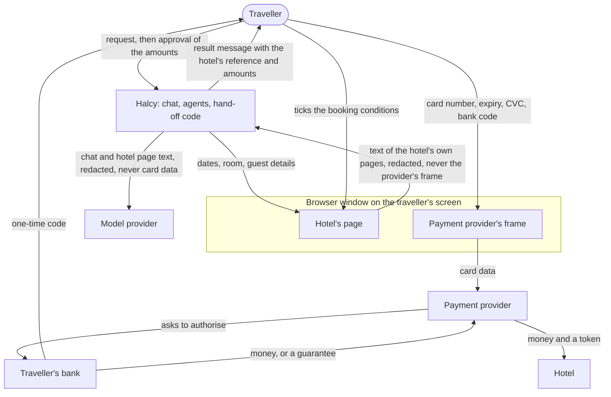

# Halcy agentic checkout: design

How Halcy turns a chat message into a hotel booking by driving the hotel's own
website, while the traveller pays the hotel directly. It answers the three
questions in `halcy_case_material/BRIEF.md`.

**State on 2026-10-06.** Built and run on two mock hotels with different
layouts. All 13 scenario cases have met a real run; one full booking and every
payment failure path have run with a script standing in for the traveller. No
person has yet paid in the window, and nothing has run on a real hotel site.
What is and is not shown is in `limitations/`.

## 1. Architecture

One Node process holds the chat server, four model-driven roles, scoring in
code, the payment hand-off and one Chromium browser. Code is under
`halcy_case_material/starter/agent/`.

**One booking, step by step.**

1. The traveller writes. A card number typed by mistake is removed before
   anything reads the message.
2. The orchestrator resolves the dates, asks one question if something
   essential is missing, and records a goal.
3. The objective role sets weights and hard constraints. Search drives the
   hotel's site (cookie banner, date picker, guest counter) and records each
   room and rate as typed facts: prices are numbers in the hotel's currency.
   Code scores them.
4. The orchestrator validates one candidate on the live page: selects it,
   declines the upsell, unticks add-ons nobody asked for, fills the
   traveller's details and stops on the payment page, the first page that
   shows taxes and the charged-now split.
5. The traveller approves one card. Code refuses approval unless the browser
   is on the candidate validated last, that validation was accepted, any
   changed price was accepted by the traveller, and the total is within their
   limit or that total was accepted.
6. Code checks the hotel's hold (however the page states it) and that the
   agreed amounts are still on the page. If not, it says why, asks the hotel
   to hold the same room again once, and re-checks. Then it goes blind: no
   read, action or screenshot.
7. The traveller types the card, ticks the conditions and confirms with their
   bank in the hotel's page.
8. The wait ends when the tab is back on the hotel's site on another page, a
   chat button is pressed, the window closes or the deadline passes. Code
   reads the hotel's page once, with card fields redacted, and decides a
   status.
9. The traveller gets a templated message: booked with the hotel's reference,
   declined in the hotel's words, or "I can't see a booking".

**Facts about the hotel rather than the room**, such as the nearest metro
stop, parking or the neighbourhood, come in the product from Halcy's places
database, which `hotels.json` stands in for. A hotel's site describes itself
in its own favour, may say nothing, and says it differently everywhere; a
places database holds the same fields for every hotel and can be checked
against a map. The prototype has no such source, so it quotes the hotel and
says so, or says the site does not say. On Villa Aurora it quoted "The
nearest stop is Pier Gardens on tram line 2, about four minutes on foot"; on
Casa Halcy, whose site says nothing about transport, it said "Metro: the site
does not say" and did not guess.

Production layout, not deployed: the same roles in a Cloud Run worker and the
hotel's site in a WebView in the Halcy app, so the hotel session is the
phone's own (`infrastructure.md`, `../agent/WEBVIEW-PLAN.md`).

## 2. Question 1: model selection

**Rule: a heavy model where an error is expensive and the volume is low; a
cheaper one where the volume is high and the error is caught downstream.**

| Role | Model | Why | When it is wrong |
| --- | --- | --- | --- |
| Orchestrator | Opus 5.5, medium | Its words go straight to the traveller | Approval is refused in code unless the rules in step 5 hold |
| Objective | Opus 5.5, low | A need scored as a wish wastes a search; one short call | Validation checks the candidate against the goal |
| Search | Sonnet 5.5, medium | Largest role, about 40% of cost; validation re-checks its result | The candidate is rejected, the traveller told why |
| Validation | Opus 5.5, low | It reads the price the traveller approves | Code overrules it on the wrong rate or currency; the hand-off re-checks the amounts |
| Scoring | none | Must be explainable and repeatable | n/a |
| Hand-off | code, plus one extraction after blind mode | No model context exists while the card is typed | No "confirmed" without a reference found on the page |

Measured on the three example asks, message to approval card
(`../agent/MODELS.md` section 5):

| Ask | All Opus 5.5 | Sonnet on search, run 1 | Run 2 |
| --- | --- | --- | --- |
| 1 | $0.31, 116 s | $0.22, 85 s | $0.27, 96 s |
| 2 | $0.47, 181 s | $0.41, 176 s | $0.38, 166 s |
| 3 | $0.40, 123 s | $0.27, 125 s | $0.28, 108 s |

Sonnet on search reached the card 6 of 6 with the same candidates and prices.
On the second hotel it did read a euro guide figure as the price in 3 of 3
runs where Opus did not; code caught it every time, and now checks every
recorded price and its currency against the page text, so the choice no
longer rests on the model. Prompt caching carries the cost: 85% of input
tokens are cache reads.

**What we measure:** bookings that reach the card; right room and rate;
validation rejections and failed actions; turns and time (the hold is
minutes); cost per completed booking; all of it on sites never seen. The bar
for a cheaper model is "no worse": about $0.10 a booking is at stake and one
failed booking outweighs many of those. Evidence is one or two runs per cell.

## 3. Question 2: staying out of payments

**The rule: no model and no Halcy log receives payment data. A model is told
a payment status, nothing else.** The payment step is code, not an agent, and
Halcy never holds, moves or collects money.

| Party | Card, CVC | Bank code | Money | Proof the traveller agreed |
| --- | --- | --- | --- | --- |
| Traveller | types it | receives, types | pays | ticks the conditions, passes the bank check |
| Payment provider | receives it | no | processes it | no |
| Bank | has it | issues, checks | approves | record of the bank check |
| Hotel | a token | no | receives it, now or at the desk | conditions accepted, booking |
| Halcy | never | never | never | approval card, price acceptances, all logged |

**Who holds the money and when.** On a pay-now rate the bank moves it to the
hotel through the hotel's provider at booking. On a pay-at-hotel rate nothing
moves; the card is a guarantee the hotel holds. Halcy is in neither path, and
every message names the hotel as the seller.

**Why Halcy stays out, in layers.** The driver never enters a frame outside
the hotel's site. During the hand-off nothing is observed, acted on or
screenshotted. Card-like fields on the hotel's own page are redacted by
field. The run log refuses page events while blind and scrubs card-like
numbers, and an audit fails any log that breaks this. "Booked" is said only
when code finds the reference verbatim on a hotel page. The traveller ticks
the conditions; the agent does not.

**The honest limit.** The boundary is "does not", not "cannot": the browser
process could read every frame, and code, tests and the audit stop it (L15).

**What would pull Halcy in.** Collecting the money and paying the hotel.
Relaying keystrokes or streaming the payment page (why a live view was
rejected). Storing a card. Using a card typed into the chat. Ticking the
hotel's conditions for the traveller. Booking through an intermediary that
becomes the seller.

**Where we are unsure** (`limitations/not-verified.md` N17 to N21): whether
operating the browser a card is typed into counts as handling card data;
whether holding money and touching card data are separate questions, as we
assume; whether a WebView script truly cannot read a provider's frame on both
phone platforms; wallets in an embedded view; hotels' terms on automation.

## 4. Question 3: the user journey

The traveller writes a request, answers a question or two, approves one card
and pays in the hotel's page. The approval card shows room, dates, "Room
€404.00", "Tourist tax, paid at the hotel: €16.00", "Total €420.00",
"Charged now: €0.00", "Paid at the hotel, to Casa Halcy: €420.00", the
cancellation terms, what differs from the request, what the site does not
say, and, when the hotel charges in another currency than the traveller's,
an estimate beside each amount: "≈ 4,726 kr (estimate at the ECB rate of 5
Oct; your bank's rate and fees decide the final amount)". The result reads "You're
booked with Casa Halcy. Booking reference CH-711228. ... Your booking and
your contract are with Casa Halcy."

| Case | What happens and what the traveller sees | Run |
| --- | --- | --- |
| Room gone | Recorded as sold out; the fallback they named is taken, or they are asked. On the second hotel a room taken on reserving was reported in the hotel's words | Every run of ask 1; second hotel |
| Price moved | Taxes added later are new lines. A changed room price is a rejection; code asks "Room when I found it: €928.00 / Room now, on Casa Halcy's own payment page: €1000.00" and logs the answer. Before the fix (PR #29), accepting led to a dead end; now the room is validated again at the accepted price and booked | Scenario 07, before and after |
| Over their limit | A limit means everything they pay. Code compares the final total with it and asks before approval | Once, with €296 found and €312 all-in (via a new limit, not the dedicated question) |
| Card declined | "The payment did not go through. Casa Halcy's page says: 'Your card was declined by your bank.' Nothing is booked", then "Try another card?" | Mock, stand-in: decline, then a second card confirmed |
| Bank confirms | Inside the provider's frame; Halcy never sees it. A wrong code is answered there; three wrong codes reach the hotel's page as a decline | Mock, stand-in |
| They go quiet | Before approval: "I've stopped because I didn't hear back. Nothing is booked and nothing has been charged." During payment: reminders, a stop 60 s before the hold ends, and "I can't see a booking on Casa Halcy's site" | Before approval once; during payment on a 1-minute hold |

After the hand-over Halcy never says "nothing was charged", because it did
not watch; a status it cannot establish is reported as unknown, with a
question.

## 5. Failure modes of the system

| What goes wrong | Detected by | Traveller sees |
| --- | --- | --- |
| Validation ends on the wrong rate or currency | Code compares page and candidate | Not offered; the reason |
| Hold short or released, or the page changed after approval | Hold and amounts re-read before going blind | The reason, one re-hold, then old and new price if different |
| Hold runs out while the bank approves | The hotel's page says the room was released | "Casa Halcy has released the room ... check with Casa Halcy" |
| Confirmation we do not recognise | No reference found verbatim | "I can't see a confirmation. Did an email arrive?" |
| Window closed or left on another site | Driver events | "I lost the booking window" |
| Model provider fails | Typed errors, refusal stop reason | "Something went wrong on my side", nothing booked |
| Hostile page text | Page text reaches models as data; payment fields cannot be acted on | Nothing; not tested |
| A site we cannot drive | Search stops after three failed attempts | Told so, nothing booked |

**Exchange rates.** The hotel's own figure, in its own currency, is what the
traveller agrees to and pays. Beside it Halcy shows an estimate in the
traveller's currency, made in code from the ECB's daily euro reference rates
(a bundled snapshot with its date when the fetch fails; no estimate when
neither exists), labelled as an estimate with the rate's date. A model never
converts: it quotes text from `estimate_prices` and `compare_prices`. Hotels
in different currencies are compared on the estimate ("Casa Halcy is about
6% cheaper than Villa Aurora at the ECB rate of 5 Oct"), and under 3% they
are called too close to call. A limit in another currency is applied to the
estimate, and within 3% of the limit the traveller is asked. What stays
uncertain: the bank's own rate and fees, a different rate on the day the
part paid at the hotel is charged, and a "pay in your own currency" offer
inside the provider's frame, which is never seen. Choosing the charge
currency over a guide price is still the search model's doing.

## 6. How we would know it works before launch

**What exists.** 13 scenario cases with a scripted traveller and a grader
that reads the run log; every case must pass the payment-boundary audit, log
no error and never have two agents on the browser. About 135 unit tests. CI
runs typecheck, tests and the audit; live runs are started by hand.

**Results.** All 13 cases have met a real run; twelve pass, and 07 now passes
after PR #29. The payment step has one full booking behind the orchestrator
and, with a stand-in, every failure path in section 4 plus a pay-now rate,
Cancel, a closed tab and an expired hold. Every run log passes the audit.

**A second hotel found what the first could not.** Different markup,
per-night prices, a fee shown late, a pre-ticked insurance, a hold stated as
"until 15:47", payment by redirect. The euro version reached the card 3 of 3
in about 90 s. The hand-off ran there twice with scripts standing in for
validation and the traveller: the tab went to the provider and back, once
confirmed ("charged now GBP 186.00, paid at the hotel GBP 10.00") and once
declined in the hotel's words. The pound version exposed a price recorded as text, a levy
counted into the price, a dead end after a mismatch, and a hold format the
hand-off could not read; all four are now fixed (PRs #29, #31). That is the
argument for testing on many sites.

**What a pass is worth.** The grader has been wrong once, passing a run that
ended on the wrong rate. Up to the card it reads what agents recorded; the
mock's own booking record, which a harness may read, should be compared first.

**Still missing.** A person paying in the window. The over-limit question
live. The redirect payment with the agents end to end, and redaction of card
fields on a provider's full page. Repeats. Real hotel sites.

**Launch gates**, on at least five unseen sites: the amount on the card
equals what the hotel recorded; right room and rate; questions per booking;
no audit failures; no "confirmed" without a reference; a known rate of
"unconfirmed", each followed up; time to the card well inside the shortest
hold; cost per completed booking. Then a supervised period with every log
read by a person.

Further reading: `closing-note.md`, `limitations/`,
`../agent/payment/DESIGN.md`, `../agent/payment/TRAPS.md`,
`../agent/MODELS.md`.
